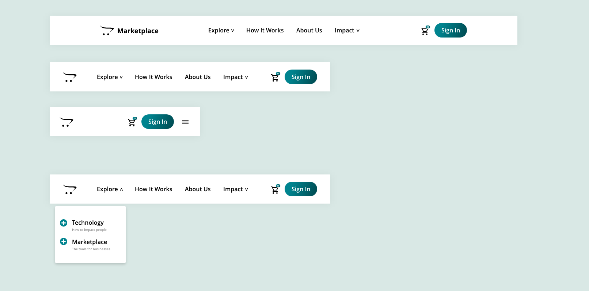

# Responsive Navbar with HTML, CSS and Javascript

In this lesson, I will show you how to create a responsive navbar. In other to do this, I made the UI version in Adobe XD which will serve as the project guide throughout the short lesson. 

To get along quickly with this course, you will need basic HTML, CSS, and JavaScript knowledge.

First, we will use HTML to build our project structure; at some point, we will add the CSS styling by making sure it appears nicely on almost every screen sizes. And finally, we will add the JavaScript functions that will respond to user clicks on small and big screen.

## HTML
*We created the project structure using the HTML5.*   

## CSS 
To make your website visitors navigate your product easily, dropdown menu is the most effective way of displaying multiple options. 

In this lesson, we customised the styling for dropdown menu which we will latter use Javascript to toggle. 

These are some of the declaration in CSS you will get used to after the lesson: 
* [CSS Positioning](https://www.w3schools.com/css/css_positioning.asp)
* [CSS Keyframes Animation](https://www.w3schools.com/cssref/css3_pr_animation-keyframes.asp)

## Javascript Logic
With Javascript, web developers can manipulate the DOM; in this tutorial, toggle an `open_nav` class whenever the user clicks on the hamburger menu or any of the dropdown menu buttons.

----
*To get along quickly with this course, you will need basic HTML, CSS, and JavaScript knowledge.*

### Key Concept: 

*[Event bubbling](https://javascript.info/bubbling-and-capturing) and event capturing was used to capture clicks whenever the user clicks on the button. Which also allows us to manipulate the [parent element](https://www.w3schools.com/jsref/prop_node_parentelement.asp).*

* addEventListener
* We used the `if` statement to check which button was click and attached the open class to the `parentElement` 

## Preview Project: 
* [InstinctHub.github.io](https://instincthub.github.io/employee_directory/)

## Credit: 
* Created By: [InstinctHub.com](https://instincthub.com/)

* [JavaScript String includes() Method](https://www.w3schools.com/jsref/jsref_includes.asp)

